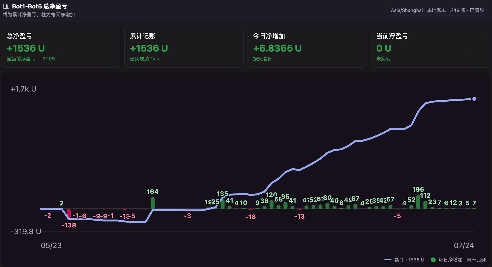

# 42Space 预测市场自动交易系统

这是一个围绕 42Space 新市场开盘窗口持续迭代的多 Bot 自动交易系统。

项目的核心不是堆叠交易命令，而是解决一个具体问题：

> 如何根据 42Space 的市场规则，在新市场开盘时争取更低成本、更靠前地买入筹码，并按照不同市场的持有周期自动退出。

系统从最初的定时买入，逐步演进到预构建、预签名、双 RPC 广播、双 Builder 私有提交、精确秒级执行和多 Bot 隔离。每次买入、卖出、Gas、Builder Tip、交易排名和最终仓位都保留链上证据。

## 42Space 是什么

[42Space](https://docs.42.space/getting-started/protocol-mechanics-101/42-markets) 是一个链上事件预测市场。一个事件会被拆成多个可能结果，每个结果对应一种 `Outcome Token`。

市场结算前，参与者可以围绕 Outcome Token：

- 买入；
- 卖出；
- 调整不同结果之间的仓位；
- 在认为筹码价格偏低时进入，在价格变化后退出。

42Space 提供 [Alpha REST API](https://docs.42.space/api/rest-api-alpha) 用于读取市场数据，并在 [BNB Chain](https://docs.42.space/api/deployments) 部署市场合约。这个项目使用 REST 与链上日志发现市场，真实交易则通过链上合约执行。

## 我们如何发现机会

新市场刚开盘时，Outcome Token 的价格和筹码分布还没有被后续资金充分改变。人工操作需要发现市场、选择结果、检查资金、签名并提交交易，很难稳定覆盖秒级窗口。

我们根据开发者文档和链上合约建立自动化流程：

```text
发现即将开盘的市场
  -> 判断是否符合策略
  -> 开盘前完成资金、授权、calldata 和签名准备
  -> 在目标秒提交交易
  -> 按市场类型自动退出
  -> 用回执、排名、Gas 和最终仓位复盘
```

机会并不来自“预测所有事件”，而是来自把开盘规则、传播速度和退出纪律转化为可重复执行的系统。

## 从无溢价到 20 秒反狙击机制

项目早期，平台开盘时没有前 20 秒反狙击溢价，策略目标相对直接：尽早买入低价筹码，再根据价格与市场变化退出。

平台后来加入前 20 秒反狙击溢价后，“越早越好”不再是唯一答案。系统因此形成两条执行路线。

| 路线 | 核心目标 | 买入原则 | 主要代价 |
| --- | --- | --- | --- |
| `T+19` | 排名优先 | 承担部分反狙击溢价，争取更早进入区块和更靠前的市场排名 | 买入成本包含部分溢价 |
| `T+20` | 成本优先 | 完全避开反狙击溢价，再争取首个 T+20 区块的前排位置 | 需要与其他等待 20 秒的交易竞争 |

两条路线不是互相替代，而是交给不同 Bot 并行验证。

## 程序如何一步步演进

### 01. 定时买入

最初版本读取市场开盘时间，到设定时刻自动触发买入，解决人工点击无法稳定命中开盘窗口的问题。

### 02. 预构建与预签名

真实运行后发现，开盘时再查询余额、检查授权、构造交易和签名会浪费关键时间。程序因此把这些工作移到开盘前，进入热窗口后只负责广播已签名交易。

### 03. 双 RPC 广播

单个 RPC 的延迟和抖动会直接影响区块位置。系统把同一笔 raw transaction 同时发送给两个独立 RPC，并在短窗口内重复广播，以最快接受结果为准。

### 04. Builder Tip

公共广播只能改善传播速度，无法稳定争取区块前排。系统随后引入两个独立 Builder，将买入交易和 Builder Tip 组成私有 bundle。

两个 Builder 的 Tip 使用相同 nonce，最多只有成功打包的一方能够收到费用。每次请求都会记录接受耗时、最终打包方和实际支付的 Tip。

### 05. 精确秒级执行与多 Bot 隔离

真实测试证明，仅依赖 Builder 的时间参数不能保证交易不会提前成交。项目随后部署链上精确秒级执行器，让 T+19/T+20 的时间边界由合约强制执行。

系统最终拆成多个独立 Bot。它们可以共享只读市场发现，但每个 Bot 都拥有自己的：

- 钱包与资金；
- RPC 与 Builder 路线；
- nonce；
- 买入时间；
- outcome 选择；
- 自动卖出规则；
- fills、决策日志和运行状态。

一个 Bot 的余额不足、nonce 异常或 RPC 故障，不会直接拖垮其他执行路线。

## 通用执行思想

```text
链上日志 + 42 REST
  -> 市场分类与买入判断
  -> profile 级资金检查与预签
  -> 双 Builder / 独立 RPC 执行
  -> 定时、价格、赛前或订单流退出
  -> 回执、排名、Gas 与仓位证据
```

关键原则：

- 展示和通知不等于自动买入；
- 开盘前完成准备，热路径不临时增加慢查询；
- 每个市场和每个 Bot 都有资金上限；
- 错过目标时间就放弃，不在市场结构已经变化后盲目追单；
- 卖出必须避让下一次买入热窗口，不能破坏预签交易的 nonce；
- “RPC 已接受”不等于“链上已成交”，必须继续检查 receipt 和最终仓位。

## 不同市场的买卖原则

| 市场类型 | 买入原则 | 自动卖出原则 | 核心思想 |
| --- | --- | --- | --- |
| Meme / FDV 区间 | 首次发现时锁定真实价格所在区间，买入命中档位及相邻档位 | 开盘后快速退出，并保留止损边界 | 先固定信息，再追求执行速度 |
| 体育精确比分 | 比较两侧非平局比分价格，选择价格更低一侧的核心比分组合 | 赛前退出、保留少量筹码，或按计划持有 | 用组合覆盖代替单点猜测 |
| 日常固定模板 | 结合外部数据判断目标结果，提前配置时间、结果和资金 | 达到目标价格或固定时间退出 | 把重复市场变成可验证流程 |
| 长周期事件 | 人工指定精确市场、结果和仓位，不使用全局默认 | 订单流触发、赛前退出或持有至结算 | 让退出方式匹配持有周期 |

## 真实结果

项目看板与完整本地活动账本快照截至 2026-07-24：

| 指标 | 结果 |
| --- | ---: |
| Bot1-Bot5 总净盈亏 | `+1536 U` |
| 历史净收益率 | `+21.0%` |
| 当日净增加 | `+6.8365 U` |
| 当前浮盈亏 | `0 U` |
| 累计 Gas | `240.63 U`，约 `0.4205 BNB / 1201 tx` |
| 本地活动账本 | `1,748` 条，完整且已同步 |



代表性执行证据：

- **西班牙 vs 阿根廷，T+19/T+20 双 Bot 收益对照**：两台 Bot 在同一个精确比分市场各买入西班牙取胜的五个核心比分，均投入 `49.60 U`。Bot1 走 T+20，买入 [`0xfcc2...bc76`](https://bscscan.com/tx/0xfcc207c4ef67bdcb9c3311c9731b024e1587307e22aa67536362888746dabc76)，卖出后扣 Gas 净收益 `+64.05 U`，收益率 `+129.1%`；Bot3 走 T+19，买入 [`0xb25f...2717`](https://bscscan.com/tx/0xb25fba354d25e310dc4d5ee5d0c2d3111f3b1b16802b9fa1ff637012f6332717)，卖出后扣 Gas 净收益 `+78.29 U`，收益率 `+157.8%`。两条路线合计投入 `99.20 U`、卖出 `251.35 U`，扣 Gas 后净收益 `+142.34 U`。
- **OpenRouter 严格 T+20**：买入交易 [`0xb1d3...57b8`](https://bscscan.com/tx/0xb1d3f3a42dd2fb1f00ac63f9fe2dba5f6400732cfc18624d8c91cac5386e57b8) 落在首个 T+20 区块，`txIndex=1`，市场排名 `1/4`；48Club 在 `239ms` 内接受 bundle，`0.001 BNB` Tip 与买入在同一区块成交。
- **T+19 修复验证**：JUGGERNAUT [`0x599a...906`](https://bscscan.com/tx/0x599a87003e898d8533050f0136e7c0ffdbb68c6e73d69320092e1758cc7f0906) 与 HOODRAT [`0x2793...6e1`](https://bscscan.com/tx/0x2793e31a0aeb932f9614c79cff7c6b3345d69b4096dbb35d8648c34158b106e1) 均在 T+19 取得市场排名第 1，并通过 Builder-only 路线完成。

这些数据用于说明已经发生的历史执行结果，不代表未来收益。

## 失败如何改变系统

- `$GENIUS` 测试中，开盘前 `750ms` 广播的交易被打进前一个区块并回滚。此后公共网络默认不做开盘前广播。
- 一次目标 T+19 的 Builder 交易实际落在 T+18，证明 Builder 时间参数不是链上硬约束。项目因此增加精确秒级执行器。
- 运行中出现过外部交易占用 nonce、单个钱包资金不足和 RPC 凭证失效。系统因此坚持多 Bot 隔离，而不是把所有资金和策略放进同一个进程。

## 项目边界

这是一个可以发送真实链上交易的实验与生产系统，不是收益承诺。

- 默认示例和本地验证保持 dry-run；
- 私钥、RPC key 和 webhook 不进入 Git；
- 实盘使用隔离的小额热钱包；
- 页面和 README 公开的是策略、历史数据与链上证据，不公开秘密配置；
- 市场风险、合约风险、Gas 风险、流动性风险和执行失败仍然存在。

## 工程文档库

- Plan 纲领：[docs/plan.md](./docs/plan.md)
- Todo 纲领：[docs/todo.md](./docs/todo.md)
- 每次改代码后，同步更新对应子 plan / 子 todo。

## 安装

```bash
npm install
cp .env.example .env
```

## 常用命令

```bash
npm run scan
npm run watch
npm run buy -- --market 0xb35953C77E03c6b2953c40844051508f31Be477B --token-id 32 --stake-usdt 5
```

## Event Market：发现新场后每个结果都买

当前文档确认的边界：

- REST API 仍是 Alpha 读接口，没有文档化的下单/授权交易 API。
- Event Markets 可以在结算前卖出；Price Markets 不能卖出，会锁到结算。
- 真实交易走 BNB Chain 合约：`FTRouterProxy`、`FTLensV2`、`BUSDT`。

RPC 配置优先读项目 `.env.local` / `.env`，再读 `~/.codex/secrets/evm-rpc-providers.env`，最后才用 public RPC。不要把 Ankr/Chainstack key 写进 README 或提交到 Git；支持的变量名是 `BSC_RPC_URL` / `CHAINSTACK_BSC_RPC_URL` / `ANKR_BSC_RPC_URL`，WSS 是 `BSC_WS_URL` / `CHAINSTACK_BSC_WS_URL` / `ANKR_BSC_WS_URL` / `ANKR_BSC_WS_RPC_URL`。

查看当前 live Event Markets：

```bash
npm run event:scan
```

查看某个钱包的 42 开放持仓：

```bash
npm run event:positions -- --wallet 0x244FcE72db40B69C4DA4D41F0a76E25B24CA201b
```

查看下一批同期开盘 Event Markets 的实盘资金门槛、当前钱包缺多少 BUSDT/BNB、是否已经能直接 `event:arm`。当前 Bot2 Event Market 策略默认每场买前 3 个 outcome，每个 outcome 买 `10U`，实盘前仍建议显式带上 `STAKE_PER_OUTCOME_USDT=10 EVENT_OUTCOME_SELECTION=first EVENT_OUTCOME_COUNT=3 MAX_MARKET_STAKE_USDT=30`：

```bash
STAKE_PER_OUTCOME_USDT=10 EVENT_OUTCOME_SELECTION=first EVENT_OUTCOME_COUNT=3 MAX_MARKET_STAKE_USDT=30 npm run event:funding -- --wallet 0x244FcE72db40B69C4DA4D41F0a76E25B24CA201b
```

查看某个 outcome 的卖出报价。默认 dry-run，只读链上余额并用 market 的 `redeemExactOtToCollateral` 报价；真实卖出会先给当前 market 设置 Router operator，再通过 `FTRouterProxy.swap(isMint=false)` 带滑点保护卖出：

```bash
npm run event:sell -- --wallet 0x244FcE72db40B69C4DA4D41F0a76E25B24CA201b --market 0x73CbB55E357fA4Ceb2d808FF7A908A7a045F6ca5 --token-id 16 --percent 100
```

如果要一次查看/卖出同一 market 下所有持仓，显式加 `--all`；Dashboard 的「一键卖出」走的也是这条路径：

```bash
npm run event:sell -- --wallet 0x... --market 0x... --all --percent 100
```

真实卖出必须显式加 `--execute` 或 `--real`；仅设置 `DRY_RUN=0 EXECUTE=1` 不会让 `event:sell` 执行真实卖出，避免报价命令继承生产环境后误卖。真实卖出时不要把私钥写进命令；命令会弹出隐藏输入框：

```bash
DRY_RUN=0 EXECUTE=1 I_UNDERSTAND_42_PRICE_MARKET_RISK=YES I_AM_NOT_IN_RESTRICTED_JURISDICTION=YES npm run event:sell -- --execute --market 0x... --token-id 16 --percent 100
```

自动卖出按新仓分批退出执行，不再使用翻倍止盈。默认规则是：新买入仓位在买入后 10 秒开始，每 10 秒卖出每个 outcome 初始筹码的 10%；如果某个 outcome 的 100% 可卖出报价相对成本跌到 `-10%`，立刻卖出该 outcome 全部剩余筹码。自动卖出会避让开盘买入热区，并尽量提前补齐 market operator 授权：

```bash
npm run event:autosell
DRY_RUN=0 EXECUTE=1 I_UNDERSTAND_42_PRICE_MARKET_RISK=YES I_AM_NOT_IN_RESTRICTED_JURISDICTION=YES npm run event:autosell -- --execute
```

无人值守运行时，把热钱包私钥放到 macOS Keychain 的 `42space-event-bot-private-key` 条目；程序会自动读取，不再弹窗。`PRIVATE_KEY` 环境变量仍然优先于 Keychain：

```bash
security add-generic-password -a 42space -s 42space-event-bot-private-key -w '0x...' -U
```

模拟最近一个 Event Market，按当前 `EVENT_OUTCOME_SELECTION` 选择 outcome。当前 Bot2 生产策略是 `first`，按 outcome 显示/token 顺序买入前 3 个选项；FDV/市值区间题材因此买入前三个市值档，每档 `10U`。旧的 `middle` 和 `lowest_odds` 策略仍可用：`middle` 买居中的 3 个选项；`lowest_odds` 优先按 `payout` 从小到大选；如果 REST/链上数据没有完整 payout 但有 price，则按 price 从大到小选；如果刚开场链上日志还没有赔率字段，默认按 token 顺序兜底并在 plan 里标记 `rankSource: token_order`。这个命令会逐 outcome 调 `FTLensV2.simulateMint`，用于分析，不是最快路径：

```bash
STAKE_PER_OUTCOME_USDT=10 EVENT_OUTCOME_SELECTION=first EVENT_OUTCOME_COUNT=3 MAX_MARKET_STAKE_USDT=30 npm run event:plan
```

指定市场模拟：

```bash
STAKE_PER_OUTCOME_USDT=10 EVENT_OUTCOME_SELECTION=first EVENT_OUTCOME_COUNT=3 npm run event:plan -- --market 0x73CbB55E357fA4Ceb2d808FF7A908A7a045F6ca5
```

监听新 Event Market。默认启动时会把现有 live Event Markets 标记为已见，只等新场；如果要启动后连现有场也买，设置 `WATCH_BUY_EXISTING=1`。

```bash
POLL_MS=500 STAKE_PER_OUTCOME_USDT=10 EVENT_OUTCOME_SELECTION=first EVENT_OUTCOME_COUNT=3 MAX_MARKET_STAKE_USDT=30 npm run event:watch
```

实盘长期在线入口使用隐藏输入私钥，不把私钥写进 `.env`：

```bash
STAKE_PER_OUTCOME_USDT=10 EVENT_OUTCOME_SELECTION=first EVENT_OUTCOME_COUNT=3 MAX_MARKET_STAKE_USDT=30 npm run event:arm
```

速度模式：

- `npm run verify`：本地确定性检查，包含语法检查和无需下一场真实市场的 Event Market 自检。
- `npm run event:bench -- --samples 5`：离线 benchmark 下一批同期开盘 bundle 的 plan 构建、bundle 编码、预签耗时；使用公开测试私钥，不广播。
- `npm run event:premium-probe`：旧的手动只读观察 anti-sniping premium 命令。默认等待下一批同一 `startDate` 的 upcoming Event Markets，每个 market 只模拟赔率最低的 1 个 outcome；适合临时复查，不适合长期捕捉开盘中创建的新市场。
- `npm run event:premium-watch`：新的长期只读 premium watcher。持续用 WSS controller 日志和 REST `status=all` 发现新市场；只要是当前/未来开盘且仍在探针尾窗内，都会先建探针 timer，Price 标签、非 V2、缺 outcomes 只能变成报告里的 quote 错误，不能阻止启动探针。开盘后 `22s` 内每 `500ms` 对所有 outcomes 做 `FTLensV2.simulateMint`，默认同时测 `1U` 和 `STAKE_PER_OUTCOME_USDT`。不签名、不广播、不写 seen/fills/runtime 状态；发现审计写 `output/premium-watch-discovery.jsonl`，设置 `EVENT_DISCOVERY_FEED_FILE` 时还会写结构化共享发现 feed，原始样本写 `output/premium-watch-*.jsonl`，完成后写 `.csv` 和 `.md`。报告里的“估算 premium”来自同一 market/outcome/stake 在链上 `>=20s` 后的正常 markup 基线扣除，不是猜官方线性公式。
- `EVENT_INTEL_NOTIFY_NON_TEMPLATE=1`：`event:premium-watch` 第一次观察到非固定模板且 `createdAt/startDate` 接近的新事件后会异步生成情报报告并发飞书；固定每天/周/月北京时间 08:00 模板只归档不通知。情报层仍会识别 Price/price range/point-in-time price 事件并默认跳过重分析；展示/飞书的 `价格` 过滤只静默 BTC Price 类事件，非 BTC Meme price-range 事件（例如 `$PUMP price range...`）会走 Bot2/Bot3/Bot5 的非过滤通知路径。通知按 market address 写入 `EVENT_INTEL_NOTIFY_SEEN_FILE` 去重，默认 `createdAt` 与 `startDate` 相差不超过 `EVENT_INTEL_CREATED_AT_OPEN_THRESHOLD_MINUTES=31` 时才发送；Bot2/Bot3/Bot5 过滤通知路径可通知所有未被 display filters 隐藏的事件。飞书通知使用卡片格式，开盘/创建时间显示为北京时间，并提供 42 市场、BscScan、REST 数据按钮；服务器本地 Markdown 报告路径不放进通知。`EVENT_INTEL_FEISHU_WEBHOOK` 应配置为 Bot1 的飞书 webhook；未配置时，只有当前进程 `BOT_NAME=42space` 或 `Bot1*` 才回退当前 profile 的 `FEISHU_WEBHOOK`，避免误发到 Bot2。
- Sports/FIFA 准确比分盘是额外通知类：即使提前创建也会发飞书；`Total Goals` 和 `Goal Differential` 这类体育侧盘口继续只归档不通知。
- `npm run event:rpc`：预热并测速 broadcast RPC 池，只输出 provider 域名、区块号、延迟和错误摘要，不打印 RPC URL。
- `npm run event:presign-test`：离线验证“pending records -> pre-signed transaction/bundle -> cached reuse”链路；按 `MAX_BATCH_STAKE_USDT` 选择可完整买入的同期开盘市场，使用公开测试私钥，只签名不广播。
- `npm run event:due-test`：离线验证“cached pre-signed transaction/bundle -> due drain -> dry-run execution”链路；按批次预算强制到期并 dry-run 执行，不广播。
- `npm run event:catchup-test`：离线验证“资金恢复后发现刚开盘未买 markets -> catch-up bundle dry-run”链路；强制把下一批未来 markets 当成刚开盘，不广播。
- `npm run event:deadline-test`：离线验证“开盘窗口过期 -> 标记跳过 -> 不再广播”的硬截止链路，不广播。
- `EVENT_DISCOVERY=ws`：通过 WebSocket 订阅 `FTControllerV2` 的 `CreateNewQuestionV2` / `AddOutcome` / `CreateNewMarket` 日志。默认值，最快，优先使用 `BSC_WS_URL` / `CHAINSTACK_BSC_WS_URL` / `ANKR_BSC_WS_URL` / `ANKR_BSC_WS_RPC_URL`。
- `EVENT_DISCOVERY=chain`：HTTP 轮询同一组 controller 日志，要求 `BSC_RPC_URL` 支持 `eth_getLogs`。
- `EVENT_DISCOVERY=rest`：REST 轮询兜底。
- `EVENT_DISCOVERY=feed`：从 `EVENT_DISCOVERY_FEED_FILE` 读取中心 watcher 写入的新事件，Bot 侧不再持续开 WSS/REST discovery；启动时仍会做一次 REST/链上 seed 以补齐重启前已经可见的未来场。feed 只传市场发现信号，买入筛选、planned-buy、预签、nonce、广播 RPC、卖出仍完全由各 profile 自己执行。
- `EVENT_DISCOVERY_FEED_FILE=output/event-discovery-feed.jsonl`、`EVENT_DISCOVERY_FEED_POLL_MS=1000`、`EVENT_DISCOVERY_FEED_TAIL_BYTES=2097152`：共享发现 feed 的文件、轮询间隔和启动尾读窗口。中心 `event:premium-watch` 写这个文件，各 Bot 可用 `EVENT_DISCOVERY=feed` 消费。
- `REST_DISCOVERY_ENABLED=1`、`REST_DISCOVERY_POLL_MS=1000`：即使主发现路径是 WSS/链上日志，也每秒轮询一次 42 REST `status=all` markets 作为补漏。REST 会暴露 `not_started` 提前场，程序会提前放入 pending 并在开盘前预构建/预签；官网 New markets 有时先通过 REST 暴露，或不落在当前 controller 日志路径里，这个旁路保证这类场次进入 5 秒开盘窗口处理。
- `WATCH_FUNDING_MODE=next_batch`：实盘 watch 启动前按已知下一批同一开盘时间的 Event Markets 合计资金校验；设为 `upper_bound` 时只按单场 `STAKE_PER_OUTCOME_USDT * min(EVENT_OUTCOME_COUNT, MAX_OUTCOMES_PER_MARKET)` 校验。
- `BUNDLE_DUE_MARKETS=1`、`MAX_BATCH_STAKE_USDT=450`：同一 `startDate` 的多个 due Event Markets 会合并成一笔 `FTRouterProxy.multicall`，用批次上限控制总风险；资金不足或超过批次上限时只买优先级最高且能完整买入的 markets。
- `EVENT_MAX_DUE_MARKETS_PER_OPEN=1`、`BUNDLE_DUE_MARKETS=0`：Bot2 当前生产单市场模式，同一开盘时间只保留最高优先级的 1 个 market，到达配置的 post-open action time 后直接广播已预签名交易。当前生产 action time 是 `T+19.5s`。`EVENT_PRICE_GATE_ENABLED` 可切回价格筛选模式；启用时并发 `simulateMint` 已选 outcomes，任意一个 `collateralFromUser / otToUser` 低于 `EVENT_PRICE_GATE_MAX_EFFECTIVE_PRICE` 就广播，这只是反狙击溢价探测，不是限价单。
- `EVENT_INTEL_BUY_FILTER=strong`、`EVENT_INTEL_BUY_FILE=output/event-intel.jsonl`：可选的 Bot2 筛选买入策略。启用后，非归档 Meme 板块事件会默认关注；REST categories 为空时，会用题目里的 token-style FDV / `$...人生` / 已知中文 meme 名称兜底识别。非 Meme 事件仍要求本地题目/来源可直接判断为 Binance strong，或情报 JSONL 已记录 `binanceRelation=strong`。固定 daily/weekly/monthly 模板和 Price 事件即使归档报告里有 strong 关系也不会自动买入；`Tweet Count` 等低交易量题材会被排除，不因 `CZ` 命中而自动买入。默认 `off`，不影响 Bot1。
- `EVENT_OUTCOME_SELECTION=first`、`EVENT_OUTCOME_COUNT=3`、`STAKE_PER_OUTCOME_USDT=10`：当前 Bot2 生产默认买入策略。每个 Event Market 按 outcome 显示/token 顺序买前 3 个选项；如果是 FDV/市值题材，就是买前三个市值档，每档 `10U`。
- `EVENT_PLANNED_BUYS_FILE=data/planned-buys.json`：profile-local 的精确买入计划。用于世界杯比分这类需要逐场指定 outcome 的 market。命中计划的 market 会只买该计划里的 outcome names 和 stake，不会套用全局 `middle`；同一开盘时间若多个 market 都在计划里，会全部进入预签/到点队列，未计划 market 仍遵守 `EVENT_MAX_DUE_MARKETS_PER_OPEN`。
- `EVENT_OUTCOME_SELECTION=lowest_odds`：旧策略。每个 Event Market 只买赔率最低的 outcome，数量由 `EVENT_OUTCOME_COUNT` 控制。链上日志缺少赔率字段时，程序会先用 42 单市场 REST 接口按地址补全 outcomes；赔率优先用 `payout` 排序，其次用 `price`。
- `EVENT_OUTCOME_SELECTION_FALLBACK=token_order`：速度优先默认值。缺少完整赔率数据时按 token 顺序继续抢，不阻断开盘买入；设为 `error` 才会在缺 odds 时跳过/报错。
- `EVENT_OUTCOME_SELECTION=all`：恢复旧策略，买入该市场全部 outcome。

`planned-buys.json` 示例：

```json
{
  "plans": [
    {
      "market": "0x56D609d651f2362000Ce7F20514762F5C0FbDa2F",
      "question": "Ecuador vs Curaçao",
      "outcomes": ["ECU 1–0 CUW", "ECU 2–0 CUW", "ECU 3–0 CUW"],
      "stakePerOutcomeUsdt": 10
    }
  ]
}
```
- `MARKET_QUESTION_ALLOWLIST_REGEX=`：可选的 profile 级题目白名单。设置后只有标题匹配该正则的 Event Market 才允许自动买入，手动关注也不能绕过；Bot2 Daily Volume 可设为 `^(BTC|ETH|BNB)/USDT Futures Daily Volume`。
- `MIN_EVENT_DURATION_HOURS=48`：只自动买入持续时间不少于 48 小时的非 Price Event Market；Daily Volume、OpenRouter 日盘会被过滤掉。
- `AUTO_SELL_STRATEGY=ladder`、`AUTO_SELL_START_DELAY_SECONDS=10`、`AUTO_SELL_INTERVAL_SECONDS=10`、`AUTO_SELL_CHUNK_PERCENT=10`、`AUTO_SELL_LADDER_PROFIT_PERCENT=100`：只对 `AUTO_SELL_APPLY_AFTER_ISO` 之后买入的新仓生效；买入后至少 10 秒，且该 outcome 的 100% 退出报价相对成本收益达到 `100%` 后，才开始每 10 秒卖出初始筹码的 10%，最多 10 轮卖完。旧的 `2x 卖 50%` 策略已取消。
- `AUTO_SELL_STRATEGY=open_timed_exit`、`AUTO_SELL_OPEN_EXIT_DELAY_SECONDS=36`、`AUTO_SELL_OPEN_EXIT_PERCENT=100`：保留 ladder 旧策略的同时新增开盘定时退出策略；对符合自动卖出 cutover 的新仓，按市场开盘 `startDate + 36s` 卖出 100%，不等待 100% 盈利门槛，`-10%` 止损仍优先。
- `AUTO_SELL_STOP_LOSS_ENABLED=1`、`AUTO_SELL_STOP_LOSS_PERCENT=10`、`AUTO_SELL_STOP_LOSS_SELL_PERCENT=100`：按单个 outcome 的 100% 退出报价计算亏损；某个 outcome 跌到 -10% 时，停止该 outcome 的分批卖出并卖出该 outcome 全部剩余筹码，其他 outcome 继续分批。自动卖出统一使用 `minOut=1`，不绑定退出价格；收益门槛开启时，分批卖出必须先成功报价确认收益达标。
- `AUTO_SELL_BUY_GUARD_BEFORE_MS=120000`、`AUTO_SELL_BUY_GUARD_AFTER_MS=10000`：只要已知待买市场进入开盘前 120 秒到开盘窗口后 10 秒，自动卖出、operator 预授权都会暂停，买入热路径最高优先级。
- `AUTO_SELL_PREAPPROVE_OPERATOR=1`、`AUTO_SELL_APPROVALS_PER_TICK=1`、`AUTO_SELL_REQUIRE_PREAPPROVED_OPERATOR=1`：自动卖出不再在真正卖出的同一笔流程里临时做 operator 授权；监控 tick 会低优先级提前补授权，未授权 market 的卖出延后到下一轮。
- `AUTO_SELL_MAX_OUTCOMES_PER_TX=8`、`AUTO_SELL_MAX_MARKETS_PER_TX=4`、`AUTO_SELL_MAX_GAS_PER_TX=12000000`、`AUTO_SELL_MAX_TX_PER_TICK=1`：到期卖出先按 outcome 独立决策，再跨 market 合并成受限批次；单轮最多发 1 笔卖出交易，避免卖出队列占住 nonce。
- `FEISHU_WEBHOOK=`：长期守护进程告警入口。生产环境放在服务器 env，不提交到 Git；会通知启动、开盘前资金不足、买入广播/失败、receipt 失败、WS/链上降级、自动卖出失败/暂停等关键事件。常态资金不足只展示在 dashboard 和日志里；`ALERT_STATE_FILE` 保存 profile-local 告警状态，避免同一问题在重启后反复刷屏。
- `MARKET_DECISIONS_FILE=data/market-decisions.jsonl`：记录每个市场的发现、过滤、待买、资金不足、买入成功/失败等决策流水，方便复盘“为什么买/没买”。
- `GAS_LEDGER_FILE=data/gas-ledger.jsonl`：profile-local Gas 明细账；每条上链交易按 `txHash` 记录 `gasUsed * effectiveGasPrice` 的 BNB 成本，并可通过 `npm run gas:backfill -- --profile-env /etc/42space/profiles/42space.env` 追溯历史交易和补 BNBUSDT 估值。
- `EVENT_BUY_MODE=fast`：不逐个报价，直接 `minOut=1` 买入选中的 outcome。抢新场默认用这个。
- `EVENT_BUY_MODE=quoted`：先模拟再买，慢但输出更完整。
- `FAST_SKIP_PREFLIGHT=1`：触发时不再查余额/allowance，依赖启动前 `event:preflight` 和 `event:approve`。
- `FAST_SKIP_DUE_REST_HYDRATION=1`：已经到点或 WS 临场发现的 market 不再等待 REST 赔率补全，直接用链上日志 outcomes 生成交易；未来待开盘 market 仍会提前补全赔率并预签。
- `FAST_NONCE_MANAGER=1`：实盘 watch 启动时取一次 pending nonce，后续本地递增，减少触发时 RPC。
- `PRE_SIGN_FAST_TX=1`、`PRE_SIGN_WINDOW_MS=60000`：已知未来场进入开盘前 60s 狙击态时预签 raw transaction；开盘热区只做广播，默认不在开盘前广播。
- `PRE_SIGN_RETRY_MS=250`：预签窗口内如果遇到瞬时错误，会按这个间隔重试；nonce 只在签名成功后递增，避免失败预签占用 nonce。
- `NONCE_SYNC_BEFORE_PRESIGN=1`、`NONCE_SYNC_MIN_INTERVAL_MS=250`：预签前按节流频率读取 pending nonce。如果 watch 启动后发生了别的交易，程序会把本地 nonce 推进到链上 pending nonce，避免签出已失效的 raw tx。若预签广播返回 stale nonce 类错误，fallback 会立即读取最新 pending nonce 并重新签名。
- `FANOUT_BROADCAST=1`：fast 实盘广播时签一次 raw transaction，并向多个 HTTP RPC 同时发送；默认只用 `CHAINSTACK_BSC_RPC_URL` 和 `ANKR_BSC_RPC_URL`，没有专线时才回退主 `BSC_RPC_URL`。
- `BROADCAST_TIMEOUT_MS=1200`：单个广播 RPC 的超时窗口。目标是尽快拿到第一个成功广播，而不是等所有 RPC 慢慢返回。
- `REBROADCAST_INTERVAL_MS=100`、`REBROADCAST_DURATION_MS=2500`：首个 RPC 接收预签 raw tx 后，后台继续按固定间隔把同一笔 raw tx 推给专线 RPC；`already known` 视为正常传播。
- `BUILDER_BUNDLE_ENABLED=1`、`BUILDER_BUNDLE_TIP_BNB=0.001`、`BUILDER_BUNDLE_MODE=builder_then_fanout`：启用共享 Builder 买入路径。计划买入里的 `builderBundle.tipBnb` 可以覆盖默认 tip；标准 RPC 回退只发送同一笔已预签买入交易，不发送 tip。
- `BUILDER_BUNDLE_TIMING_MODE=auto`：只把 T+18.x/T+19.x 的买入映射到严格 19 秒/20 秒首区块模式。19 秒模式在 T+18 预提交，20 秒模式在 T+19 预提交，并统一设置 `minTimestamp=maxTimestamp`；T+22 等其他时间自动保持 RPC-only。
- `BUILDER_BUNDLE_PREPOSITION_LEAD_MS=1000`、`BUILDER_BUNDLE_FALLBACK_SAFETY_MS=100`：Builder 请求必须在本地 RPC 回退前结束。Builder 接受后若错过唯一目标秒，程序放弃下一秒买入、清理相关预签名并重新同步 nonce。
- `RPC_WARMUP_TIMEOUT_MS=2500`：`event:rpc` 和实盘 `event:watch` 启动时预热 broadcast RPC 的超时窗口。实盘开跑前会先创建并连通 raw-tx client，避免开盘瞬间才初始化 HTTP transport。
- `DOCTOR_CHECK_WS=0`：`event:doctor` 默认不打开 WSS 长连接；要单独测 WSS 时设为 `1`。
- `WATCH_STARTUP_RETRY_MS=5000`：启动时如果 REST 补种、链上回放或 chain watch 初始区块读取遇到瞬时网络错误，按这个间隔告警/重试；WS 模式下 REST/链上补种失败不会直接退出主进程。
- `ARM_WAIT_FOR_FUNDING=1`、`ARM_FUNDING_RETRY_MS=60000`：长期守护进程资金不足时不退出，按普通间隔复查 BUSDT/BNB/allowance；资金补足后自动进入 WS watch。
- `ARM_FUNDING_HOT_WINDOW_MS=600000`、`ARM_FUNDING_HOT_RETRY_MS=1000`：距离下一批开盘小于热窗口时，资金复查自动切到 1 秒，避免临近开盘补款后最多睡 60 秒。
- `ARM_CATCH_UP_AFTER_FUNDING=1`、`ARM_CATCH_UP_WINDOW_MS=60000`：如果守护进程因为资金不足没进入 watch，资金补足后启动时只会追赶仍在 `EVENT_OPEN_WINDOW_SECONDS` 内、尚未买过的 Event Markets；catch-up 会为缺少 odds 的 due market 补一次 REST 赔率以尽量严格选择当前配置的最低赔率档，超过窗口仍标记 seen，避免误买老盘。
- `EVENT_LOG_LOOKBACK_BLOCKS=50000`：启动时回放最近 controller 日志，把已创建但未开盘的未来 Event Market 放入 pending，避免开盘时漏买。
- `LOG_CHUNK_BLOCKS=5000`：HTTP 回放/轮询时分块 `eth_getLogs`，避免 Chainstack 这类付费 RPC 的 block range 限制。
- `HOT_POLL_MS=25`、`PREOPEN_HOT_MS=60000`：已知未来开盘场进入开盘前 60s 后，把 pending 检查切到更高频；最后一跳会贴近开盘点醒来。
- `PREBROADCAST_MS=750`、`ALLOW_PREOPEN_BROADCAST=0`：默认不在开盘前广播已签名 raw tx。`$GENIUS` 事故证明 T-750ms 会被 BSC 打进开盘前一个区块并被合约拒绝；只有明确接受这个风险时才把 `ALLOW_PREOPEN_BROADCAST` 设为 `1`。如果预签交易已上链并 `reverted`，程序会停止复用同一笔 raw tx；仅当该 tx 是开盘前广播导致的失败且仍在开盘窗口内，才会丢弃旧签名、同步 nonce 后补签补发。
- `OPEN_BROADCAST_DELAY_MS=0`、`OPEN_BROADCAST_SCHEDULE_AHEAD_MS=60000`、`OPEN_BROADCAST_SPIN_MS=15`：默认在合约开盘时间之后立刻广播，不提前广播。已知 future market 会在开盘前 60s 内注册专用 timer，最后 15ms 用短 spin 减少 Node timer 抖动；如果交易已经预签名，开盘瞬间不再二次查询资金，直接 fanout 已签 raw tx。
- `WS_RECEIPT_FALLBACK_MS=0`：WS 收到 `CreateNewMarket` 但本地 buffer 里还没齐 outcome 日志时，默认立刻用交易 receipt 补齐同 tx 日志，避免等待 `POLL_MS`。
- WSS receipt fallback 会按 txHash 复用已拉取并解析的创建交易 receipt，避免同一笔创建交易里多个 market 重复 `getTransactionReceipt/getBlock`。
- `FAST_GAS_LIMIT=8000000`、`BUNDLE_FAST_GAS_LIMIT=20000000`、`GAS_PRICE_GWEI=2.0`：避免触发时查 gas price。单场和 bundle 都会按 market/outcome 数计算基础动态 gas limit；GTA trace 证明 9 outcome 首买的 `3.15M` 动态 gas limit 会 OOG，现在 9 outcome 单场基础动态值为 `7.0M`，3 场/15 outcome bundle 基础动态值为 `11.7M`。这里主要修的是 `gas limit`，不是盲目提高 `gas price`；GTA 开盘块内 `2 gwei` 仍高于 p99 附近交易与首个成功买入的 `1.3 gwei`，比 `3 gwei` 降低约三分之一失败成本。
- `FAST_GAS_WALLET_BUDGET=1`、`FAST_GAS_WALLET_BUDGET_BPS=10000`、`FAST_GAS_BLOCK_LIMIT_BPS=10000`、`FAST_GAS_TX_LIMIT=16777216`：实盘预签/补签时不再让 `FAST_GAS_LIMIT` / `BUNDLE_FAST_GAS_LIMIT` 成为硬 cap，而是按 pending BNB 余额和固定 `GAS_PRICE_GWEI` 计算这笔交易最多能承受的 gas limit，并受当前区块 gas limit 与 BSC 单笔交易 gas 上限约束。也就是说，开盘买入优先避免 OOG，但不会签出 RPC 直接拒收的超限交易；钱包里的 BNB 就是买入 gas 预算。
- Dashboard 手动卖出保护：默认在下一场开盘前 `PRE_SIGN_WINDOW_MS + 15s` 到开盘后 `EVENT_OPEN_WINDOW_SECONDS + 15s` 内，报价和执行都会被拒绝，避免手动卖出消耗 nonce 破坏已预签名的买入交易。可用 `DASHBOARD_MANUAL_SELL_HOT_GUARD_MS` 调整额外保护时间。
- `WAIT_FOR_RECEIPT=0`：fast 买入热路径只等 raw tx 被 RPC 接收，不在交易锁内等待 receipt；market 会先按“已广播”处理，避免同一窗口重复烧 gas 或挡住下一场。
- `ASYNC_RECEIPT_WATCH=1`、`RECEIPT_WATCH_TIMEOUT_MS=120000`、`RECEIPT_WATCH_POLLING_MS=1000`：后台等待 receipt，并把成功/失败写入 `FILLS_FILE`、Gas ledger 和决策日志；失败通过飞书告警复盘，不阻塞开盘广播。
- `EXECUTION_RETRY_MS=500`：只针对签名/广播前错误或 RPC 全部拒收重试；只要 raw tx 已被接受，就不在 5 秒窗口里重复买入。
- `EVENT_OPEN_WINDOW_SECONDS=5`：硬截止。市场开盘超过 5 秒仍未成功买入时，自动监听会写入 `event-skip-open-window`，把该 market 加入 seen，并从 pending 删除；真实 `event:buy` / bundle 入口也会在发交易前拒绝超窗 market，除非显式设置 `ALLOW_LATE_BUY=1`。

对于已经创建但未来才开盘的 Event Market，watch 会在 pending 阶段提前构建 fast plan；实盘有 signer/receiver 时会进一步预编码 `FTRouterProxy.multicall` calldata。开盘瞬间只做 nonce/gas 已知路径上的签名与广播；同一 startDate 同时开盘的多个 Event Markets 会并行触发，并在广播前立即预留本地 nonce，避免并行交易复用 nonce。

WSS 模式下，`event:watch` 会先建立 controller 日志订阅，再做 REST/链上 startup seed；启动期新出现的市场日志会先进入队列，避免“先回放、后订阅”中间窗口漏事件。WSS 日志到达会立即唤醒监听循环处理，不再等下一次 `POLL_MS` 醒来。实盘 nonce 会在资金预检和 RPC warmup 之后再读取，尽量贴近后续预签/广播。

同一批链上日志里解出多个 market 时，发现后的处理按顺序推进，避免多个立即执行路径同时改本地 nonce。真正同期开盘的 pending markets 仍会优先走 `BUNDLE_DUE_MARKETS=1` 的单笔 bundle 交易。

如果一批新发现的 Event Markets 在发现时已经到达可交易时间，程序会先按相同 `startDate` 尝试即时 bundle，再回退到单 market 顺序执行。这覆盖“创建即开场”的事件批次，减少多笔交易和 nonce 竞争。

钱包/授权预检：

```bash
npm run event:doctor
npm run event:doctor -- --wallet 0x...
npm run event:preflight
```

`event:doctor` 会按链上已知的下一批同期开盘 Event Markets 计算所需 BUSDT；`requiredBusdt` 是当前 `WATCH_FUNDING_MODE` 下的真实启动门槛，`requiredBusdtUpperBound` 只是单场兜底上限，不代表下一批一定只需要这么多。加 `--wallet` 可以只读检查 bot 地址的余额和 allowance，不需要加载私钥。doctor/preflight 还会估算 fast 交易的 BNB gas reserve：固定 gas limit 的交易在广播前需要账户能覆盖 `gasLimit * gasPrice`，即使最后实际消耗低于 gas limit。

实盘前必须提前授权 Router。不要等新场出现后才授权，否则会多一笔交易，速度会输：

```bash
npm run event:approve
```

`event:approve` 和实盘 `event:arm` / `event:watch` 启动预授权都会按 `MAX_BATCH_STAKE_USDT`、`MAX_MARKET_STAKE_USDT`、当前 outcome 配置三者里的最大值检查 BUSDT allowance；只要低于门槛，就提前把 BUSDT 对 Router 授权到最大值。生产无人值守默认开启：

```bash
AUTO_APPROVE_ROUTER_ON_START=1
```

回放最近链上 controller 生命周期日志，验证解析、过滤和 fast plan 构造：

```bash
npm run event:replay
```

查看长期 bot 状态、资金上限、最近 live 场和未来 pending Event Market：

```bash
npm run event:status -- --wallet 0x...
```

用最近的未来 Event Market 做 dry-run 演练，不发交易，只验证“链上发现 -> 预构建 fast plan -> 到点执行计划”的本地路径：

```bash
npm run event:rehearse
```

## 策略

- `binance_volume_projection`：针对 `BTC/USDT Futures Daily Volume` 这类市场，从 Binance Futures 读取 BTCUSDT 日线成交额，用最近完整日均值和当日实时成交额估算最终区间。
- `binance_price_projection`：针对 `BTC price range` 这类市场，从 Binance spot 读取 BTCUSDT 当前价格，选择当前价格所在区间。
- `cheapest`：选择当前价格最低的 outcome。
- `configured`：必须设置 `TARGET_OUTCOME_REGEX`，按正则选择 outcome。

查看 Binance Futures `BTCUSDT` 每小时成交额热力表。输出横向日期、纵向 UTC 小时；已完成小时会缓存在 `data/binance-hourly-klines.jsonl`，后续只补缺口和刷新当前未完成小时：

```bash
npm run volume:heatmap -- --symbol BTCUSDT --days 7 --date 2026-05-28 --output output/btcusdt-volume-heatmap.md
```

查看 BTC 价格区间场：

```bash
TARGET_TOPIC=Bitcoin TARGET_QUESTION_REGEX='BTC price range' STRATEGY=binance_price_projection npm run scan
```

如果 42 后续标签又变了，可以去掉 topic 过滤：

```bash
TARGET_TOPIC= TARGET_QUESTION_REGEX='BTC price range' STRATEGY=binance_price_projection npm run scan
```

## 真实买入开关

真实链上买入只支持 42 V2 market。分析命令 `event:plan` 会用 `FTLensV2.simulateMint` 模拟选中的 outcome；抢新场默认走 fast 模式，直接通过 `FTRouterProxy.multicall` 批量调用 `swap`。要执行真买入，`.env` 必须同时设置：

```bash
DRY_RUN=0
EXECUTE=1
I_UNDERSTAND_42_PRICE_MARKET_RISK=YES
I_AM_NOT_IN_RESTRICTED_JURISDICTION=YES
PRIVATE_KEY=0x...
BSC_RPC_URL=...
```

Event Market 实盘命令：

```bash
STAKE_PER_OUTCOME_USDT=5 EVENT_OUTCOME_COUNT=5 MAX_MARKET_STAKE_USDT=25 npm run event:minimal
STAKE_PER_OUTCOME_USDT=5 EVENT_OUTCOME_COUNT=5 MAX_MARKET_STAKE_USDT=25 npm run event:buy
```

为了速度，fast `event:watch` 不会在发现新场后临时发 approve，也不会再逐笔 simulate、查余额、查 allowance。它假设启动前已经 `event:preflight` 和 `event:approve`，然后直接广播批量 mint；raw tx 被 RPC 接收后立即释放交易锁，receipt 后台确认。`event:approve` 会提前把 BUSDT 对 Router 的 allowance 批到最大值；不要在主钱包里运行，使用小额热钱包。

注意：Price Markets 文档明确说退出不允许，买入后通常只能等结算。开盘抢筹也不保证成交顺序或收益，REST 轮询不是 mempool 级抢跑。
